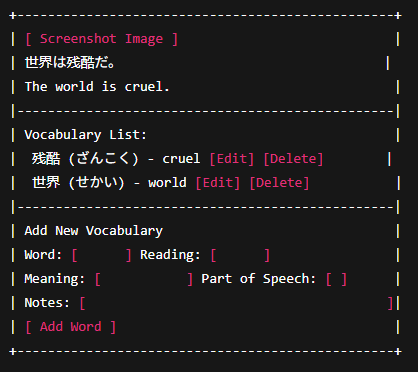

# Animemorize

## Overview

Flashcard tools like Anki are effective for rote memorization, but they can get repetitive.  
**Animemorize** brings Japanese learning to life by letting users upload screenshots from their favorite anime, along with the Japanese sentence and its vocabulary breakdown.  

Each screenshot becomes a *visual flashcard*, helping users connect words to real scenes.  
Users can search by anime title, episode, or vocabulary to discover new words through meaningful context.

---

## Data Model

The application uses three main collections:

1. **User**
   - Stores user login information and tracks uploaded screenshots.
2. **Screenshot**
   - Stores each uploaded anime scene with Japanese text, English translation, and metadata (anime name, episode, uploader).
3. **VocabEntry**
   - Stores vocabulary items linked to a screenshot, including readings, meanings, and notes.

### Relationships
- Each **User** can upload multiple **Screenshots**.
- Each **Screenshot** can have multiple **VocabEntries**.

### Sample Documents

#### Example User
```javascript
{
  username: "faust",
  hash: "hashed_password_here",
  uploads: [ObjectId("6720b123abc456def7890123")] // references to Screenshot documents
}
```

#### Example Screenshot
```javascript
{
  animeTitle: "Attack on Titan",
  episode: 12,
  sentence: "世界は残酷だ。",
  translation: "The world is cruel.",
  imageUrl: "https://res.cloudinary.com/animemorize/screenshots/attack12.png",
  uploader: ObjectId("6720b123abc456def7890123"),
  createdAt: ISODate("2025-10-29T20:00:00Z")
}
```

#### Example VocabEntry
```javascript
{
  screenshotId: ObjectId("6720b789abc456def7890123"),
  word: "残酷",
  reading: "ざんこく",
  meaning: "cruel, harsh",
  partOfSpeech: "na-adjective",
  notes: "Commonly used in dramatic dialogue"
}
```

---

## [Link to Commented First Draft Schema](models/db.mjs)

Schemas for `User`, `Screenshot`, and `VocabEntry` are included and commented in `models/db.mjs`.

---

## Wireframes

### `/` — Homepage  
Displays search bar and list of recent uploads.  


### `/upload` — Upload Screenshot Form  
Form for adding new screenshots with sentence and translation.  


### `/screenshot/:id` — Screenshot Detail  
Displays image, sentence, translation, and vocab list with form to add new vocab words.  


---

## Site Map

```
Home
 ├── Browse Screenshots (/browse)
 │     ├── Screenshot Detail (/screenshot/:id)
 │     │     ├── Add/Edit/Delete Vocab
 │     └── Upload Screenshot (/upload)
 └── About
```

---

## User Stories

1. As a user, I can upload a screenshot with Japanese text and translation.  
2. As a user, I can add vocabulary entries to a screenshot.  
3. As a user, I can browse screenshots uploaded by others.  
4. As a user, I can search for screenshots by anime title or vocabulary.  
5. As a user, I can edit or delete my uploads.  

---

## Research Topics

| Topic | Description | Points |
|-------|--------------|--------|
| **Tailwind CSS** | For styling and responsive anime-themed UI | 2 |
| **ESLint + Vite** | For build automation and linting workflow | 3 |
| **Cloudinary API** | For image upload and hosting integration | 3 |
| **Kuromoji.js** | For parsing Japanese text into vocabulary suggestions | 2 |
| **Total** |  | **10** |

---

## [Link to Initial Main Project File](app.mjs)

Skeleton Express app initialized with:
- `express` and `mongoose`
- `app.mjs` for server setup
- `.gitignore`, `package.json`
- `models/` for schemas  
- `views/` folder for templates  
- `public/` for static assets

---

## Annotations / References Used

1. Express documentation — server setup reference  
2. Mongoose docs — schema examples  
3. Cloudinary Node.js SDK docs — image upload integration  
4. Kuromoji.js GitHub — Japanese tokenizer for vocab suggestions  
5. Tailwind CSS docs — styling  
