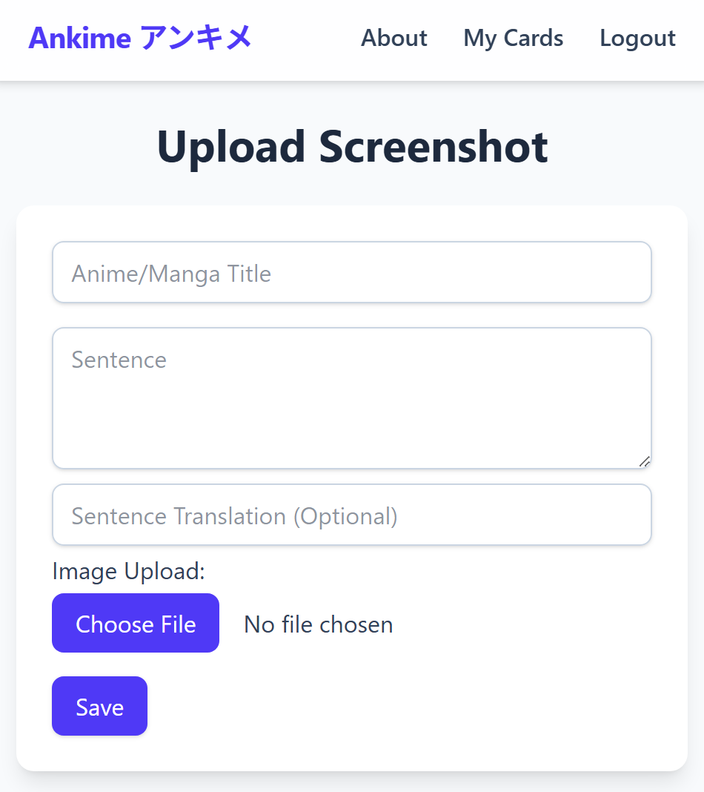
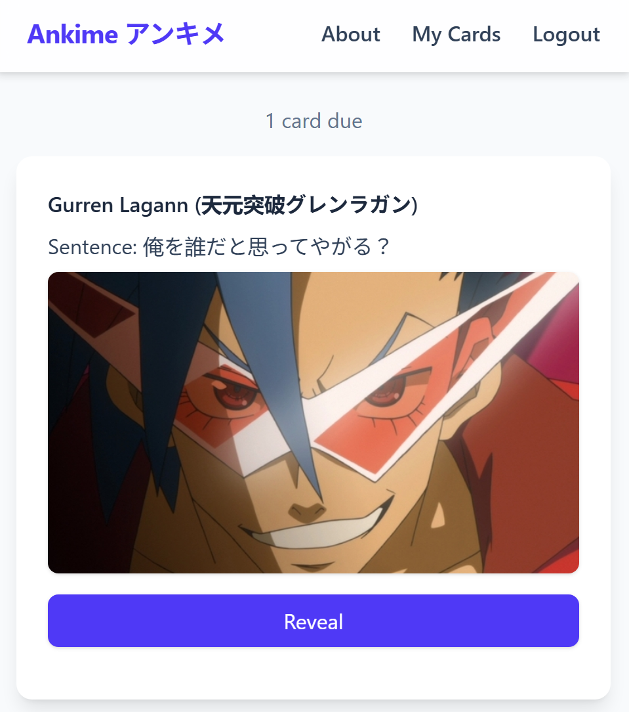

# Ankime

**Ankime** is a full-stack web application that turns anime screenshots into
**visual flashcards** for Japanese language learners.

Instead of drilling abstract vocabulary lists, Ankime lets users upload real
scenes from anime or manga, attach the Japanese sentence and its vocabulary
breakdown, and review them using a spaced-repetition-style system.  
The goal is to anchor vocabulary in **visual and narrative context**.

---

## Features

- **User authentication**
  - Registration and login via username and password
  - Session-based authentication with Passport

- **Screenshot-based flashcards**
  - Upload anime/manga screenshots
  - Add Japanese sentence, English translation, and vocab entries
  - Public and private cards

- **Vocabulary breakdown**
  - Per-word entries with reading, meaning, part of speech, and notes

- **Spaced Repetition–style review**
  - Cards store review metadata (interval, repetitions, ease factor)
  - Review queue shows cards due for practice

- **Search & discovery**
  - Browse public cards
  - Search by anime title, vocabulary, or uploader

- **Anime metadata integration**
  - Anime and manga titles synced via the AniList API

---

## Screenshots




---

## Tech Stack

**Backend**
- Node.js
- Express
- MongoDB + Mongoose
- Passport (local strategy)
- express-session
- express-rate-limit

**Frontend**
- Server-rendered views using Handlebars (hbs)
- TailwindCSS + PostCSS for styling

**Storage & Integrations**
- AWS S3 for image storage
- multer + multer-s3 for uploads
- AniList API for anime/manga metadata

---

## Data Model Overview

The application uses five main collections:

- **User** — authentication and account data  
- **Screenshot** — uploaded images with sentence, translation, and metadata  
- **VocabEntry** — vocabulary items linked to a screenshot  
- **UserCard** — per-user review state for screenshots  
- **AniTitle** — anime/manga titles synced from AniList  

Relationships are designed so that:
- A screenshot can have multiple vocabulary entries
- Users can save screenshots to their own deck with independent review data
- Public cards can be reused by multiple users

---

## Getting Started (Local Development)

### Prerequisites

- **Node.js** (v18+ recommended)
- **npm**
- **MongoDB** (local or hosted)
- **AWS S3 bucket** (for image uploads)

---

### Installation

```bash
git clone https://github.com/JackREscowitz/ankime-fullstack.git
cd ankime-fullstack
npm install
````

---

### Environment Variables

Create a `.env` file in the project root:

```env
PORT=3000
DSN=mongodb://127.0.0.1/ankime
SECRET=your_session_secret

AWS_REGION=us-east-1
S3_BUCKET_NAME=your_s3_bucket_name
AWS_ACCESS_KEY_ID=your_access_key
AWS_SECRET_ACCESS_KEY=your_secret_key
```

> ⚠️ Do not commit your `.env` file. It is excluded by `.gitignore`.

---

### Running the App

```bash
npm run dev
```

Then open:

```
http://localhost:3000
```

---

### Syncing AniList Titles

To fetch or update anime/manga titles from AniList:

```bash
npm run sync:anilist
```

---

## Project Background

This project originated as a university course assignment and has since been
cleaned up and maintained as a personal project to showcase full-stack
development skills, API integration, and cloud-based file storage.

---

## Future Improvements

* More advanced SRS algorithms and analytics
* Deck sharing and following other users
* Improved mobile UX
* Optional deployment as a PWA
