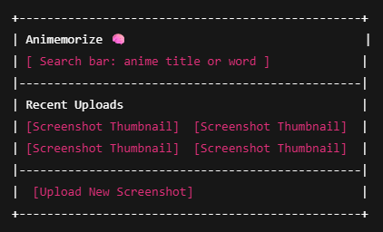
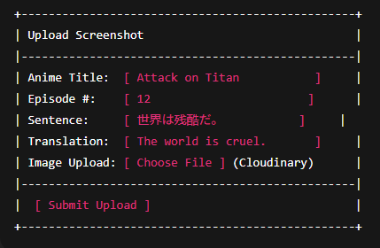
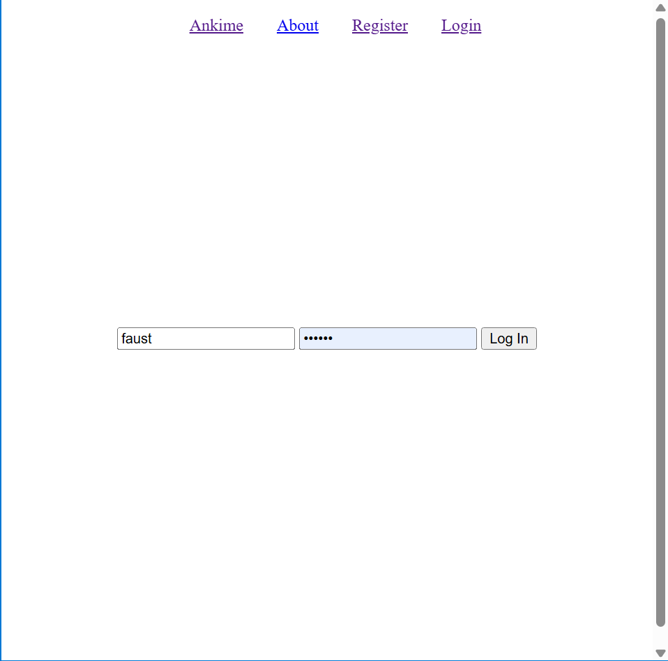
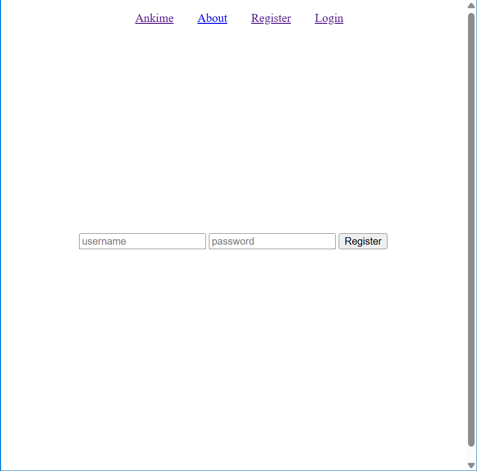

# Ankime

## Overview

Flashcard tools like Anki are effective for rote memorization, but they can get repetitive.  
**Ankime** brings Japanese learning to life by letting users upload screenshots from their favorite anime, along with the Japanese sentence and its vocabulary breakdown.  

Each screenshot becomes a *visual flashcard*, helping users connect words to real scenes.  
Users can search by anime title, vocabulary, or uploader to discover new words through meaningful context.

## Data Model

The application uses three main collections:

1. **User**
   - Stores user login information.
2. **Screenshot**
   - Stores each uploaded anime/manga scene with Japanese text, English translation, and metadata.
3. **VocabEntry**
   - Stores vocabulary items linked to a screenshot, including readings, meanings, and notes.
4. **UserCard**
   - Stores screenshots that belong to users, such that they can be edited and reviewable.

### Relationships
- Each **Screenshot** can point to a **User** (creator).
- Multiple **VocabEntries** can point to a **Screenshot**.
- Each **UserCard** can point to a **User** (owner) and **Screenshot**.

### Sample Documents

#### Example User
```javascript
{
  username: "faust",
  hash: // a password hash here
}
```

#### Example Screenshot
```javascript
{
  title: "Attack on Titan",
  sentence: "世界は残酷だ。",
  translation: "The world is cruel.",
  imageUrl: // cloud database URL,
  public: true,
  creator: // reference to User,
  createdAt: ISODate("2025-10-29T20:00:00Z")
  updatedAt: ISODate("2025-11-13T20:00:00Z")
}
```

#### Example VocabEntry
```javascript
{
  screenshotId: // reference to Screenshot,
  word: "残酷",
  reading: "ざんこく",
  meaning: "cruel, harsh",
  partOfSpeech: "na-adjective",
  notes: "Commonly used in dramatic dialogue"
}
```

### Example UserCard
```javascript
{
  user: // reference to User,
  screenshot: // reference to Screenshot,

  // Review State
  isInReview: true,
  interval: 16,
  repetitions: 3,
  easeFactor: 2.5,
  nextReview: ISODate("2025-12-25T20:00:00Z")
  createdAt: ISODate("2025-10-29T20:00:00Z"),
  updatedAt: ISODate("2025-11-13T20:00:00Z")
}
```

---

## [Link to Commented First Draft Schema](models/db.mjs)

Schemas for `User`, `Screenshot`, `VocabEntry`, and `UserCard` are included and commented in `models/db.mjs`.

---

## Wireframes

### `/` - Homepage  
Displays search bar and list of recent uploads.  


### `/upload` - Upload Screenshot Form  
Form for adding new screenshots with sentence and translation.  


### `/user/login` - Login Page
Page for logging in with username and password.


### `/user/register` - Register Page
Page for registering with username and password.


---

## Site Map

```
Home
 ├── Browse Screenshots (/browse)
 ├── Register (/user/register)
 ├── Login (/user/login)
 ├── About (/about)
 └── My Cards (/my-cards)
       ├── Upload Screenshot (/upload)
       ├── Browse My Cards (/browse)
       └── Review (/review)
```

---

## User Stories

1. As a user, I can upload a screenshot with Japanese text and translation.  
2. As a user, I can add vocabulary entries to a screenshot.  
3. As a user, I can browse screenshots uploaded by others.  
4. As a user, I can search for screenshots by anime title or vocabulary.  
5. As a user, I can edit or delete my uploads.  

---

## Research Topics

| Topic | Description | Points |
|-------|--------------|--------|
| **Tailwind CSS** | For styling and responsive anime-themed UI | 2 |
| **ESLint + Vite** | For build automation and linting workflow | 3 |
| **Cloudinary API** | For image upload and hosting integration | 3 |
| **Kuromoji.js** | For parsing Japanese text into vocabulary suggestions | 2 |
| **Total** |  | **10** |

---

## [Link to Initial Main Project File](src/app.mjs)

Skeleton Express app initialized with:
- `express` and `mongoose`
- `app.mjs` for server setup
- `.gitignore`, `package.json`
- `models/` for schemas  
- `views/` folder for templates  
- `public/` for static assets

---

## Annotations / References Used

1. Express documentation — server setup reference  
2. Mongoose docs — schema examples  
3. Cloudinary Node.js SDK docs — image upload integration  
4. Kuromoji.js GitHub — Japanese tokenizer for vocab suggestions  
5. Tailwind CSS docs — styling  
