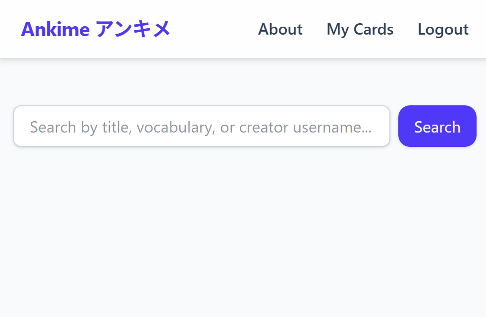
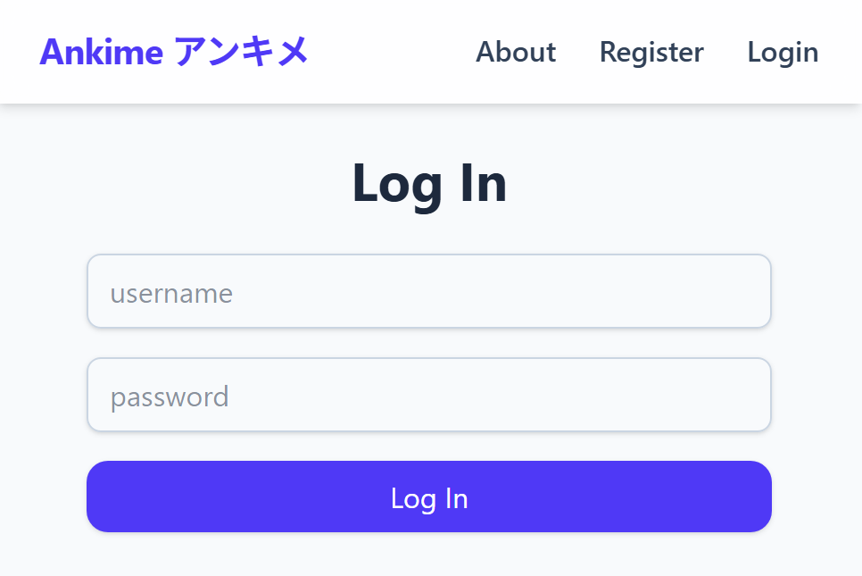
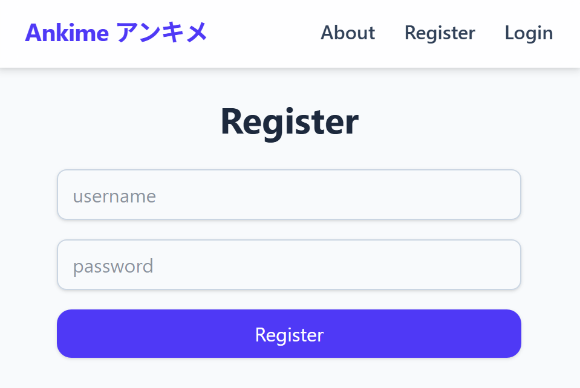
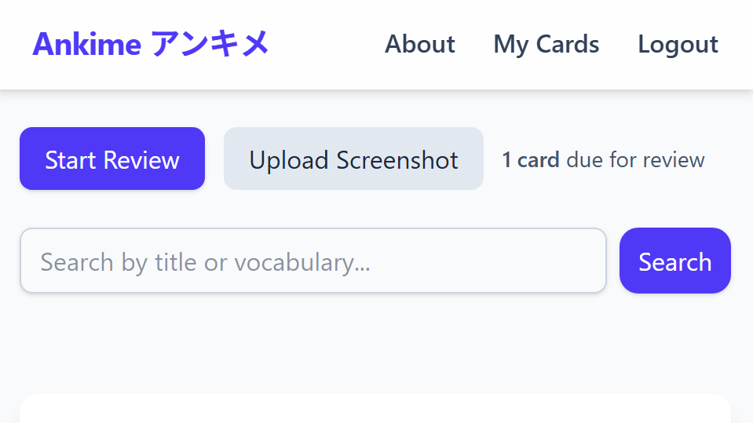

# Ankime

## Overview

Flashcard tools like Anki are effective for rote memorization, but they can get repetitive.  
**Ankime** brings Japanese learning to life by letting users upload screenshots from their favorite anime, along with the Japanese sentence and its vocabulary breakdown.  

Each screenshot becomes a *visual flashcard*, helping users connect words to real scenes.  
Users can search by anime title, vocabulary, or uploader to discover new words through meaningful context.

## Data Model

The application uses five collections:

1. **User**
   - Stores user login information.
2. **Screenshot**
   - Stores each uploaded anime/manga scene with Japanese text, English translation, and metadata.
3. **VocabEntry**
   - Stores vocabulary items linked to a screenshot, including readings, meanings, and notes.
4. **UserCard**
   - Stores screenshots that belong to users, such that they can store review metadata.
5. **AniTitle**
   - Stores anime/manga titles, regularly made up to date via Anilist API.

### Relationships
- Each **Screenshot** can point to a **User** (creator) and a **AniTitle**.
- Multiple **VocabEntries** can point to a **Screenshot**.
- Each **UserCard** can point to a **User** (owner) and **Screenshot**.

### Sample Documents

#### Example User
```javascript
{
  username: "faust",
  hash: // a password hash here
}
```

#### Example Screenshot
```javascript
{
  anilist_id: 16498,
  title: "Attack on Titan",
  sentence: "世界は残酷だ。",
  translation: "The world is cruel.",
  imageUrl: // Full S3 URL,
  s3Key: // Unique identifier within S3
  public: true,
  creator: // reference to User,
  createdAt: ISODate("2025-10-29T20:00:00Z")
  updatedAt: ISODate("2025-11-13T20:00:00Z")
}
```

#### Example VocabEntry
```javascript
{
  screenshot: // reference to Screenshot,
  word: "残酷",
  reading: "ざんこく",
  meaning: "cruel, harsh",
  partOfSpeech: "na-adjective",
  notes: "Commonly used in dramatic dialogue"
}
```

### Example UserCard
```javascript
{
  user: // reference to User,
  screenshot: // reference to Screenshot,

  // Review State
  isInReview: true,
  interval: 16,
  repetitions: 3,
  easeFactor: 2.5,
  nextReview: ISODate("2025-12-25T20:00:00Z")
  createdAt: ISODate("2025-11-29T20:00:00Z"),
  updatedAt: ISODate("2025-12-09T20:00:00Z")
}
```

### Example AniTitle
```javascript
{
  anilist_id: 16498,
  title: "Attack on Titan",
  native_title: "進撃の巨人",
  type: "ANIME",
  updated_at: ISODate("2025-10-20T20:00:00Z")
}
```
---

## [Link to Models Directory](models/)

Schemas for `User`, `Screenshot`, `VocabEntry`, and `UserCard` are included and commented in `models/db.mjs`. The `AniTitle` Schema is in `models/aniTitle.mjs`.

## Wireframes

### `/` - Homepage  
Displays search bar.



### `/user/login` - Login Page  
Page for logging in with username and password.



### `/user/register` - Register Page  
Page for registering with username and password.



### `/my-cards` - My Cards Page  
Page for actions relevant to cards the user owns.  



### `/my-cards/upload` - Upload Screenshot Page  
Page for uploading screenshots and adding vocab entries.  


### `/my-cards/review` - Review Page
Page for reviewing cards.


---

## Site Map

```
Home
 ├── Register (/user/register)
 ├── Login (/user/login)
 ├── About (/about)
 └── My Cards (/my-cards)
       ├── Upload Screenshot (/upload)
       ├── Browse My Cards (/browse)
       └── Review (/review)
```

---

## User Stories

1. As a non-registered user, I can browse the publicly available cards.  
2. As a non-registered user, I can register a new account with the site.  
3. As a user, I can log into the site
4. As a user, I can add publicly available cards to my own deck.
5. As a user, I can make my own cards in the upload page.
6. As a user, I can browse my own cards.
7. As a user, I can do Spaced Repetition System (SRS) based reviews with my cards.

---

## Research Topics

| Topic | Description | Points |
|-------|--------------|--------|
| **Tailwind CSS + PostCSS** | For styling and responsive anime-themed UI | 2 |
| **multer + multer-S3** | For screenshot upload | 2 |
| **AWS S3 + AWS SDK S3 Client** | For image hosting in the cloud | 3 |
| **AniList API** | For fetching up to date list of anime/manga | 2 |
| **express-rate-limit** | For limiting requests to prevent abuse | 1 |
| **Total** |  | **10** |

---

## [Link to Initial Main Project File](src/app.mjs)

## Annotations / References Used

1. Express documentation — server setup reference  
2. Mongoose docs — schema examples  
3. NPM documentation
4. Anilist API docs
5. Tailwind CSS docs — styling  
6. AWS S3 docs — Bucket setup, usage, IAM roles and users